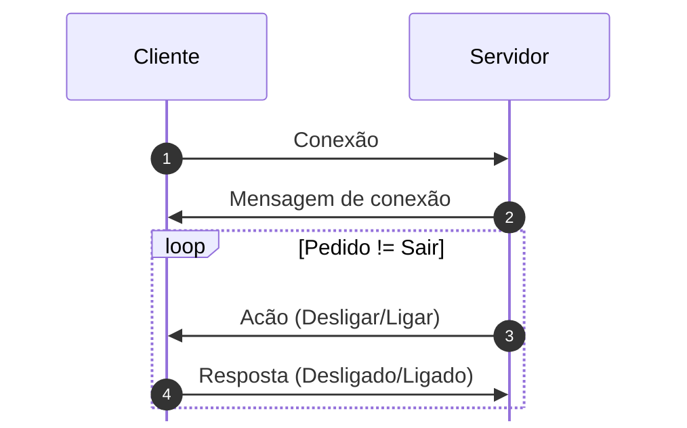
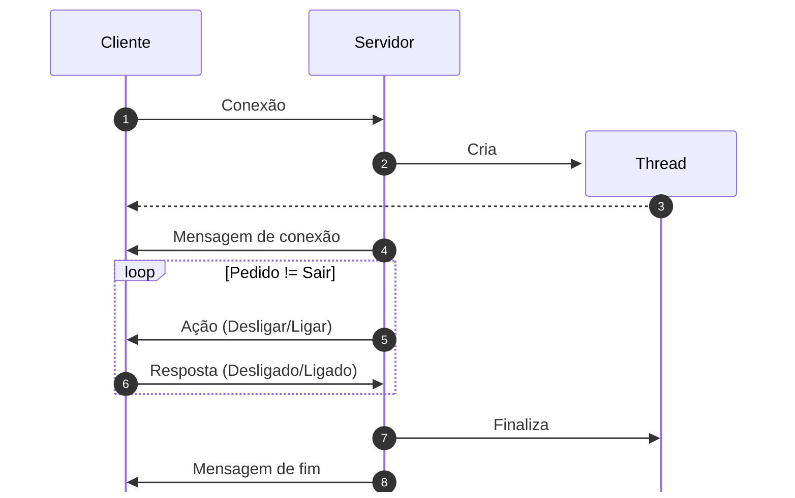

# Diagrama de sequência do protocolo

## Conceitual

## Implementação

## Descriçao

Caso exista mais clientes, entao a o Servidor criara mais threads com as mesmas acoes descritas.

1. **Cliente** solicita conexao com o servidor 

1. **Servidor** Cria a thread

1. **Thread** Conecta com o cliente

1. **Servidor** responde que esta conectado com o cliente

1. **Açao** do servidor no cliente desliga ou liga o iot client

1. **Cliente** responde seu estado atual ou seja se esta ligado ou desligado

1. Apos receber a mensagem sair o servidor finaliza a **thread** 

1. **Servidor** diz que esta desconectando ao cliente
