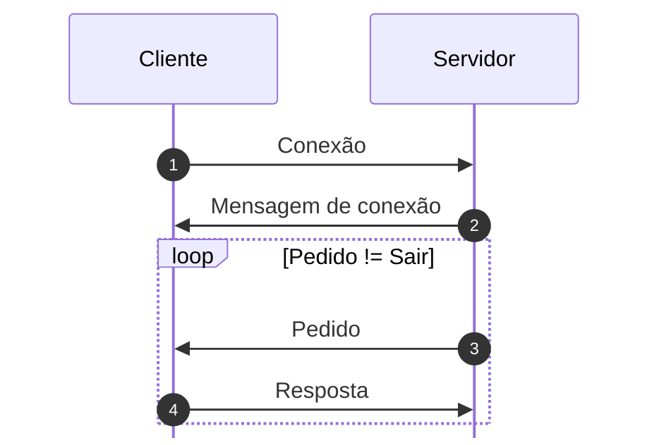
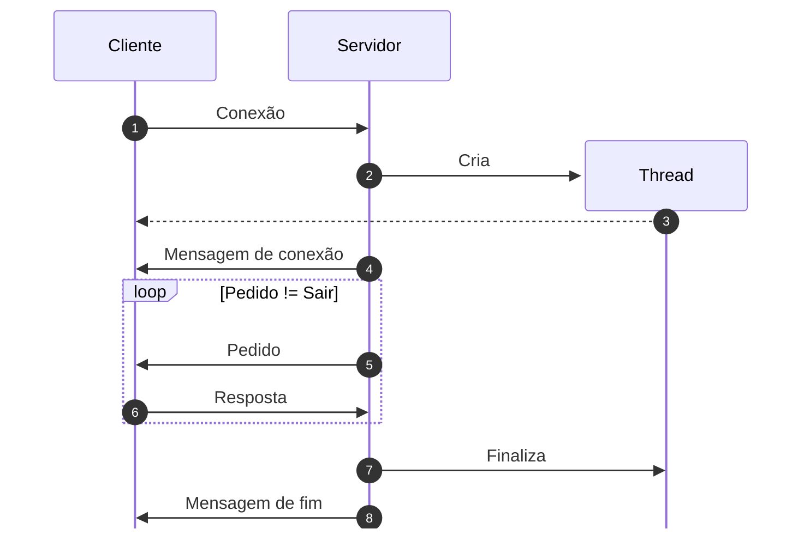

# Diagrama de sequência do protocolo

## Conceitual

```mermaid
---
config:
    sequence:
    mirrorActors: false
---
sequenceDiagram
autonumber
    participant C as Cliente
    participant S as Servidor

    C ->> S: Conexão
    S ->> C: Mensagem de conexão
    loop Pedido != Sair
        S ->> C: Pedido
        C ->> S: Resposta
    end
```

## Implementação

```mermaid
---
config:
    sequence:
    mirrorActors: false
---
sequenceDiagram
autonumber
    participant C as Cliente
    participant S as Servidor

    C ->> S: Conexão
    create participant T as Thread
    S ->> T: Cria
    T -->> C: 
    S ->> C: Mensagem de conexão
    loop Pedido != Sair
        S ->> C: Pedido
        C ->> S: Resposta
    end
    S ->> T: Finaliza
    S ->> C: Mensagem de fim
```
